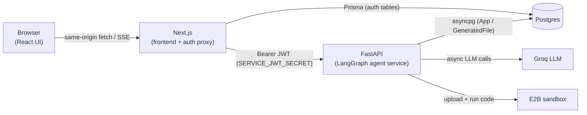

# CodeBuddy

Describe an app in one sentence and watch an AI agent **plan it, architect it, and write the code** — then sign in, save your generated apps, and run them live in an isolated cloud sandbox.

CodeBuddy is a full-stack product built around a [LangGraph](https://langchain-ai.github.io/langgraph/) agent. A Next.js frontend drives the agent through a streaming API, Google login gates per-user persistence in Postgres, and a "run" mode boots the generated code in an [E2B](https://e2b.dev) sandbox so you can see it actually working.

---

## What it does

1. **Generate** — you enter a prompt (e.g. *"A CLI todo app in Python"*). A three-node agent turns it into a real, multi-file codebase, streaming its progress live.
2. **Save** — every generation is persisted per user (Google sign-in), with its plan, task breakdown, and generated files retrievable later.
3. **Run** — for a saved app, spin up an isolated sandbox that installs dependencies and either serves a live preview (web apps) or runs the script and shows its output (CLI apps).

---

## Architecture

CodeBuddy is three cooperating services plus Postgres and E2B:



- **`agent/` + `helper/` — the LangGraph agent** (Python). The original core: a `StateGraph` of three async nodes that generate the codebase. Unchanged in shape by the web layer; just made async and multi-tenant.
- **`server/` — FastAPI service** (Python). Wraps the agent behind HTTP, streams progress over Server-Sent Events, verifies a short-lived service token, persists results, and drives the E2B sandbox.
- **`web/` — Next.js app** (TypeScript). The UI plus NextAuth (Google) login. The browser never calls FastAPI directly: a server-side proxy attaches a signed, short-lived JWT and forwards requests (streaming SSE through unchanged).

### Why the split?
The agent is Python (LangGraph/LangChain), so it stays Python and is exposed over HTTP rather than rewritten for Node. Streaming uses **SSE** (server→client only, survives proxies, maps directly onto `graph.astream()`). Auth is bridged with a **short-lived HS256 JWT** minted by the Next.js server from the NextAuth session and verified by FastAPI — so FastAPI never has to decode NextAuth's own session format, and the browser (whose native `EventSource` can't send headers) never talks to FastAPI directly.

---

## The agent pipeline

```
prompt ──▶ planner ──▶ architect ──▶ coder ──▶ (loop until done)
```

- **planner** (`agent/graph.py`) — turns the prompt into a structured `Plan` (name, description, tech stack, features, files) via the LLM's structured output.
- **architect** — expands the `Plan` into an ordered `TaskPlan` of per-file implementation tasks.
- **coder** — a tool-using agent (`langchain.agents.create_agent`) that loops over the tasks, reading/writing files through sandboxed filesystem tools, until every step is complete.

Files are written under a **per-request project root** (a `contextvars`-isolated directory `STORAGE_ROOT/{userId}/{appId}`) so concurrent generations never collide.

---

## Tech stack

| Layer | Tech |
|---|---|
| Agent | LangGraph, LangChain, `langchain-groq` (Groq `openai/gpt-oss-120b`) |
| Backend | FastAPI, Uvicorn, `sse-starlette`, `asyncpg`, PyJWT, `e2b` |
| Frontend | Next.js 16 (App Router), React 19, Tailwind CSS v4 |
| Auth | NextAuth / Auth.js v5, Google OAuth |
| Database | Postgres, Prisma 6 (schema + migrations) |
| Sandbox | E2B hosted sandboxes |
| Tooling | `uv` (Python), npm (Node), pytest |

---

## Repo layout

```
CodeBuddy/
├── agent/              # LangGraph agent: graph, prompts, state models, file tools
├── helper/             # ChatGroq LLM instance
├── server/             # FastAPI service
│   ├── main.py         #   app + lifespan (DB pool) + CORS
│   ├── auth.py         #   service-token (JWT) verification
│   ├── db.py           #   asyncpg queries against Prisma-owned tables
│   ├── storage.py      #   per-user/app file storage helpers
│   ├── sandbox.py      #   E2B run-code integration
│   ├── ratelimit.py    #   sliding-window rate limiter
│   └── routers/        #   apps (generate/list/detail/files) + run
├── tests/              # pytest (rate limiter)
├── web/                # Next.js frontend
│   ├── app/            #   pages + /api/auth + /api/backend proxy
│   ├── components/     #   GenerateForm, FileViewer, RunPanel, UserNav
│   ├── lib/            #   prisma client, server-side apiFetch
│   ├── auth.ts         #   NextAuth config
│   └── prisma/         #   schema + migrations
└── pyproject.toml      # Python deps (uv)
```

---

## Prerequisites

- **Python 3.11+** and [`uv`](https://docs.astral.sh/uv/)
- **Node.js 20+** and npm
- A **Postgres** database (local, or a free hosted one — [Neon](https://neon.tech) / [Supabase](https://supabase.com))
- A **Groq API key** — https://console.groq.com
- **Google OAuth credentials** — https://console.cloud.google.com (OAuth client; see below)
- *(optional, for run mode)* an **E2B API key** — https://e2b.dev

---

## Environment variables

Secrets live in two gitignored files. `SERVICE_JWT_SECRET` **must be identical** in both.

**Root `.env`** (FastAPI + agent):

| Var | Required | Notes |
|---|---|---|
| `GROQ_API_KEY` | ✅ | Groq LLM key |
| `DATABASE_URL` | ✅ | Postgres connection string |
| `SERVICE_JWT_SECRET` | ✅ | Shared secret; must match `web/.env` |
| `STORAGE_ROOT` | – | Where generated files go (default `./generated_projects`) |
| `E2B_API_KEY` | – | Enables run mode; without it `/run` returns 503 |
| `E2B_SANDBOX_TIMEOUT` | – | Sandbox TTL seconds (default 900) |
| `RATE_LIMIT_GENERATE_MAX` / `_WINDOW` | – | Generation limit per user (default 5 / 60s) |
| `RATE_LIMIT_RUN_MAX` / `_WINDOW` | – | Run limit per user (default 10 / 60s) |

**`web/.env`** (Next.js + Prisma) — see `web/.env.example`:

| Var | Required | Notes |
|---|---|---|
| `DATABASE_URL` | ✅ | Same Postgres (Prisma reads `.env`, not `.env.local`) |
| `AUTH_SECRET` | ✅ | NextAuth secret (`node -e "console.log(require('crypto').randomBytes(32).toString('base64'))"`) |
| `GOOGLE_CLIENT_ID` / `GOOGLE_CLIENT_SECRET` | ✅ | Google OAuth client |
| `SERVICE_JWT_SECRET` | ✅ | Same value as root `.env` |
| `API_BASE_URL` | ✅ | FastAPI base URL, e.g. `http://127.0.0.1:8000` |

For Google OAuth, add this **authorized redirect URI**: `http://localhost:3000/api/auth/callback/google`

---

## Setup & running locally

```bash
# 1. Python deps
uv sync

# 2. Frontend deps
cd web && npm install

# 3. Create the database schema (from web/, Prisma owns migrations)
npx prisma migrate deploy   # or `npx prisma migrate dev` in development
cd ..

# 4. Start the FastAPI agent service (repo root)
uv run uvicorn server.main:app --reload --port 8000
#    (point web/.env API_BASE_URL at whatever port you use)

# 5. Start the Next.js frontend (in web/)
cd web && npm run dev
```

Open http://localhost:3000, sign in with Google, and generate an app.

---

## Testing

```bash
uv run pytest            # Python unit tests (rate limiter)
cd web && npm run build  # type-check + build the frontend
```

---

## Scaling & HLD notes

The design keeps the servers effectively **stateless** (per-request storage roots, JWT sessions, no in-memory user state) so they can scale horizontally behind a load balancer. Concepts considered for growth:

- **Rate limiting** — ✅ *implemented*. A per-user sliding-window limiter (`server/ratelimit.py`) guards the token-costly generation and sandbox-run endpoints, returning `429` with `Retry-After`. In-memory today; a multi-instance deployment would back it with Redis.
- **Caching (Redis)** — cache-aside in front of hot read paths (app lists / detail).
- **Message queue** — move generation off the request path into a producer/consumer queue for retries and burst absorption.
- **Read replicas** — route reads to a replica, writes to the primary (Prisma read-only connection).
- **Object storage** — swap the on-disk `STORAGE_ROOT` for S3 so generated files aren't tied to one instance.

---

## Status

| Milestone | State |
|---|---|
| 1. FastAPI SSE wrapper around the agent | ✅ |
| 2. Next.js frontend | ✅ |
| 3. Postgres + Prisma + Google login | ✅ |
| 4. Auth-wired persistence (per-user apps) | ✅ |
| 5. Run-code mode via E2B | ✅ code-complete (live run needs `E2B_API_KEY`) |
| Rate limiting | ✅ |
