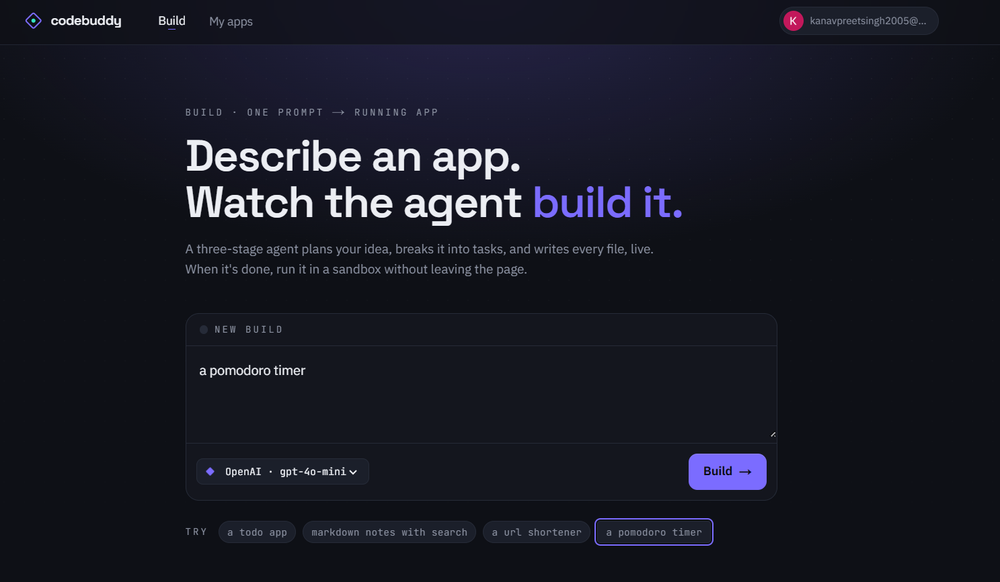
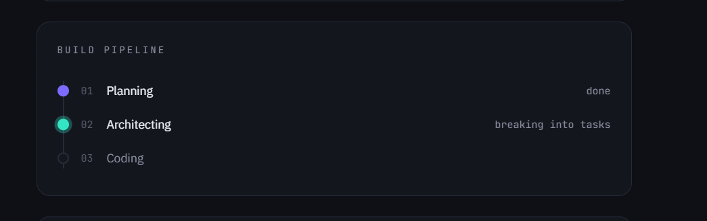
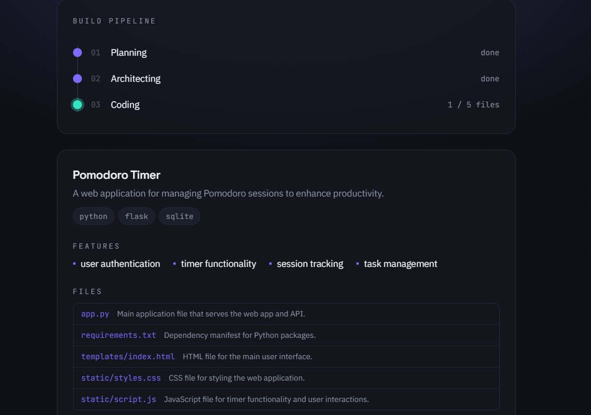
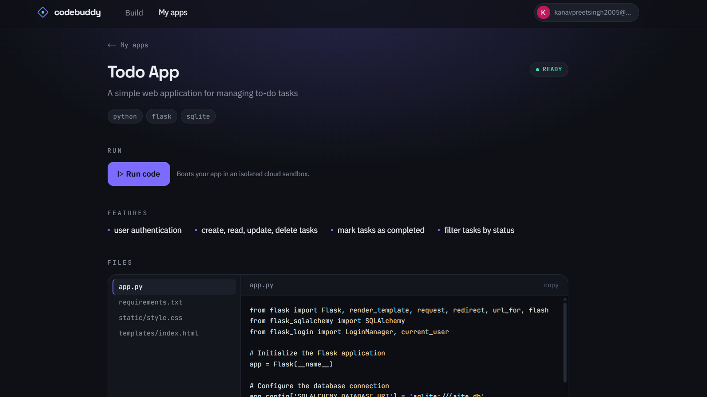
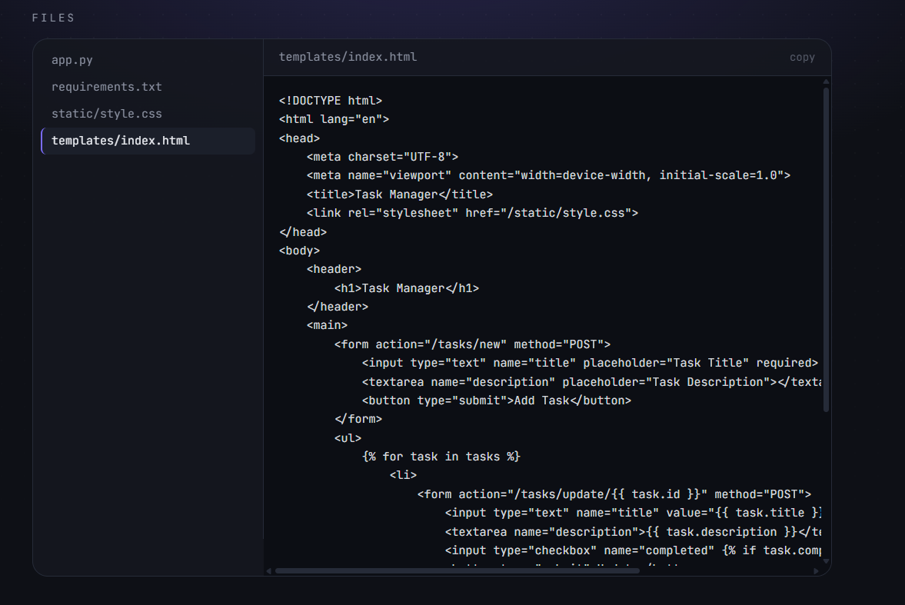
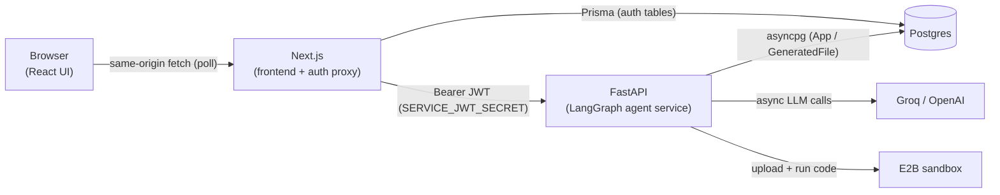

# CodeBuddy

Describe an app in one sentence and watch an AI agent **plan it, architect it, and write the code** — then sign in, save your generated apps, run them live in an isolated cloud sandbox, and ask the agent to fix anything that's broken.

CodeBuddy is a full-stack product built around a [LangGraph](https://langchain-ai.github.io/langgraph/) agent. A Next.js frontend drives the agent through a polling API, Google login gates per-user persistence in Postgres, and a "run" mode boots the generated code in an [E2B](https://e2b.dev) sandbox so you can see it actually working.

---

## What it does

1. **Build** — enter a prompt (e.g. *"a pomodoro timer"*). A three-stage agent plans it, breaks it into tasks, and writes every file — with live progress on screen.
2. **Save** — every build is persisted per user (Google sign-in): its plan, task breakdown, and generated files are retrievable later from **My apps**.
3. **Run** — boot a saved app in an isolated sandbox: a live preview for web apps, captured output for scripts.
4. **Fix** — if something's broken, describe the problem on the app's page and the agent rereads its own files and patches them — without discarding correct code elsewhere in the project.

---

## Screenshots

**Build a new app** — describe it, pick a model (OpenAI `gpt-4o-mini` or Groq, free), and go. Example prompts are one click away.


**Watch it get built** — the pipeline updates live as the agent works through planning, architecting, and coding.


**Per-file coding progress**, shown alongside the generated plan — tech stack, features, and the file list with each file's purpose.


**A saved app's detail page** — Run code boots it in a real E2B sandbox; the built-in file viewer lets you inspect any generated file without leaving the browser.


**The file viewer's code pane**, showing a generated HTML template.


---

## Architecture

CodeBuddy is three cooperating services plus Postgres and E2B:



- **`agent/` + `helper/` — the LangGraph agent** (Python). A `StateGraph` of async nodes that generate (and fix) the codebase, plus tool-using file I/O agents.
- **`server/` — FastAPI service** (Python). Wraps the agent behind HTTP, runs builds/fixes as background tasks polled by the frontend, verifies a short-lived service token, persists results, and drives the E2B sandbox.
- **`web/` — Next.js app** (TypeScript). The UI plus NextAuth (Google) login. The browser never calls FastAPI directly: a server-side proxy attaches a signed, short-lived JWT and forwards requests.

### Why polling, not streaming?
The first version streamed build progress over SSE. In production testing this turned out fragile: real browsers send `Accept-Encoding: gzip`, and Next.js's built-in response compression buffers the *entire* stream before sending it — the UI would sit on "Planning" until the backend had already finished, even though it worked fine under `curl` (which doesn't request gzip by default). Rather than keep fighting compression/proxy/buffering layers, `POST /api/apps` now returns immediately and runs generation as a background task; the frontend polls `GET /api/apps/{id}/progress` every 1.5s. Simpler, and robust by construction — every request is short and complete, nothing to buffer or hold open.

### Why the service split?
The agent is Python (LangGraph/LangChain), so it stays Python and is exposed over HTTP rather than rewritten for Node. Auth is bridged with a **short-lived HS256 JWT** minted by the Next.js server from the NextAuth session and verified by FastAPI — so FastAPI never has to decode NextAuth's own session format, and the browser never talks to FastAPI directly.

---

## The agent pipeline

```
prompt ──▶ planner ──▶ architect ──▶ coder ──▶ (loop until done)
                                        ▲
                     "what's wrong?" ───┘  (fixer reuses the coder's tools)
```

- **planner** (`agent/graph.py`) — turns the prompt into a structured `Plan` (name, description, tech stack, features, files).
- **architect** — expands the `Plan` into an ordered `TaskPlan` of per-file implementation tasks.
- **coder** — a tool-using agent (`langchain.agents.create_agent`) that loops over the tasks, reading/writing files through sandboxed filesystem tools, until every step is complete. Retries a step at a higher temperature on transient tool-call failures, rereading the file fresh on every attempt.
- **fixer** — given a user's bug report (and optionally captured run output), rereads the app's existing files and patches only what's broken, via the same tools as the coder.

Both Groq (`openai/gpt-oss-120b`, free) and OpenAI (`gpt-4o-mini`, via the [AICredits](https://aicredits.in) proxy) are selectable per build, with token usage and an estimated cost shown after each run.

Files are written under a **per-request project root** (a `contextvars`-isolated directory `STORAGE_ROOT/{userId}/{appId}`) so concurrent generations never collide.

---

## Reliability layer

Generated code is only as good as what actually runs — this project treats "the agent said it's done" and "it genuinely works in a live sandbox" as two different claims, and every fix below was found and verified by actually running real generated apps end-to-end in E2B, not by inspecting code:

- **`agent/tools.py` — `edit_file(path, old_string, new_string)`**: a find-and-replace tool for targeted patches, so the coder/fixer edit existing correct code in place instead of regenerating whole files and risking discarded work.
- **Syntax validation at write time**: `write_file`/`edit_file` run `ast.parse()` on the result for `.py` files and refuse to save invalid syntax, returning the exact error to the agent so it can self-correct immediately — instead of a broken file landing on disk and only failing much later as an opaque sandbox crash.
- **`server/sandbox.py` — deterministic run-time patches**, applied to *any* app regardless of when it was generated:
  - `_strip_stdlib_requirements` — strips standard-library modules (e.g. `sqlite3`) that the coder sometimes lists in `requirements.txt`; these have no installable PyPI distribution and fail the whole `pip install` otherwise.
  - `_ensure_flask_serves` — Flask apps run as `python entry.py`, not `flask run` (which never executes `if __name__ == "__main__":`, silently skipping DB init and `app.run()`), and the entry file is patched to guarantee it binds `0.0.0.0` on the expected port regardless of what the generated `app.run()` call itself specified.
- **`server/ratelimit.py`** — per-user sliding-window limits on generation and run endpoints, `429` with `Retry-After`.
- Hardened prompts requiring a working `/` route (even for API-only apps), a real dependency manifest, and correct Flask-SQLAlchemy `app_context()` usage.

---

## Tech stack

| Layer | Tech |
|---|---|
| Agent | LangGraph, LangChain, `langchain-groq`, `langchain-openai` |
| Models | Groq `openai/gpt-oss-120b` (free) · OpenAI `gpt-4o-mini` via AICredits |
| Backend | FastAPI, Uvicorn, `asyncpg`, PyJWT, `e2b` |
| Frontend | Next.js 16 (App Router), React 19, Tailwind CSS v4 |
| Auth | NextAuth / Auth.js v5, Google OAuth |
| Database | Postgres, Prisma 6 (schema + migrations) |
| Sandbox | E2B hosted sandboxes |
| Tooling | `uv` (Python), npm (Node), pytest |

---

## Repo layout

```
CodeBuddy/
├── agent/              # LangGraph agent
│   ├── graph.py        #   planner / architect / coder / fixer nodes + graph wiring
│   ├── prompts.py       #   all agent prompts
│   ├── states.py        #   Plan / TaskPlan / State models
│   └── tools.py          #   sandboxed file I/O tools (read/write/edit/list) + syntax checks
├── helper/              # Multi-model LLM factory (Groq + OpenAI) + cost estimation
├── server/               # FastAPI service
│   ├── main.py           #   app + lifespan (DB pool) + CORS
│   ├── auth.py            #   service-token (JWT) verification
│   ├── db.py               #   asyncpg queries against Prisma-owned tables
│   ├── storage.py           #   per-user/app file storage helpers
│   ├── sandbox.py            #   E2B run-code integration + reliability patches
│   ├── progress.py            #   in-memory build/fix progress store (polled by frontend)
│   ├── ratelimit.py            #   sliding-window rate limiter
│   └── routers/                #   apps (generate/list/detail/files/fix) + run
├── tests/                # pytest (tools, sandbox detection, rate limiter)
├── web/                  # Next.js frontend
│   ├── app/               #   pages + /api/auth + /api/backend proxy
│   ├── components/         #   GenerateForm, FixPanel, FileViewer, RunPanel, TopBar, ...
│   ├── lib/                 #   prisma client, server-side apiFetch
│   ├── auth.ts               #   NextAuth config
│   └── prisma/                 #   schema + migrations
├── docs/screenshots/     # README images
└── pyproject.toml        # Python deps (uv)
```

---

## Prerequisites

- **Python 3.11+** and [`uv`](https://docs.astral.sh/uv/)
- **Node.js 20+** and npm
- A **Postgres** database (local, or a free hosted one — [Neon](https://neon.tech) / [Supabase](https://supabase.com))
- A **Groq API key** — https://console.groq.com (free tier is enough)
- *(optional)* an **OpenAI-compatible key** for the more reliable `gpt-4o-mini` option (e.g. [AICredits](https://aicredits.in) or OpenAI directly)
- **Google OAuth credentials** — https://console.cloud.google.com (OAuth client; see below)
- *(optional, for run mode)* an **E2B API key** — https://e2b.dev

---

## Environment variables

Secrets live in two gitignored files. `SERVICE_JWT_SECRET` **must be identical** in both.

**Root `.env`** (FastAPI + agent):

| Var | Required | Notes |
|---|---|---|
| `GROQ_API_KEY` | ✅ | Groq LLM key |
| `OPENAI_API_KEY` | – | Enables the `gpt-4o-mini` model option |
| `OPENAI_BASE_URL` | – | OpenAI-compatible proxy base URL (default `https://aicredits.in/v1`) |
| `DATABASE_URL` | ✅ | Postgres connection string |
| `SERVICE_JWT_SECRET` | ✅ | Shared secret; must match `web/.env` |
| `STORAGE_ROOT` | – | Where generated files go (default `./generated_projects`) |
| `E2B_API_KEY` | – | Enables run mode; without it `/run` returns 503 |
| `E2B_SANDBOX_TIMEOUT` | – | Sandbox TTL seconds (default 900) |
| `RATE_LIMIT_GENERATE_MAX` / `_WINDOW` | – | Generation limit per user (default 5 / 60s) |
| `RATE_LIMIT_RUN_MAX` / `_WINDOW` | – | Run limit per user (default 10 / 60s) |

**`web/.env`** (Next.js + Prisma) — see `web/.env.example`:

| Var | Required | Notes |
|---|---|---|
| `DATABASE_URL` | ✅ | Same Postgres (Prisma reads `.env`, not `.env.local`) |
| `AUTH_SECRET` | ✅ | NextAuth secret (`node -e "console.log(require('crypto').randomBytes(32).toString('base64'))"`) |
| `GOOGLE_CLIENT_ID` / `GOOGLE_CLIENT_SECRET` | ✅ | Google OAuth client |
| `SERVICE_JWT_SECRET` | ✅ | Same value as root `.env` |
| `API_BASE_URL` | ✅ | FastAPI base URL, e.g. `http://127.0.0.1:8000` |

For Google OAuth, add this **authorized redirect URI**: `http://localhost:3000/api/auth/callback/google`

---

## Setup & running locally

```bash
# 1. Python deps
uv sync

# 2. Frontend deps
cd web && npm install

# 3. Create the database schema (from web/, Prisma owns migrations)
npx prisma migrate deploy   # or `npx prisma migrate dev` in development
cd ..

# 4. Start the FastAPI agent service (repo root)
uv run uvicorn server.main:app --port 8000
#    (point web/.env API_BASE_URL at whatever port you use)
#    NOTE: don't run this with --reload — the coder agent writes files into
#    generated_projects/ under the repo, and a file watcher will restart the
#    server mid-build, killing the in-flight generation.

# 5. Start the Next.js frontend (in web/)
cd web && npm run dev
```

Open http://localhost:3000, sign in with Google, and build an app.

---

## Testing

```bash
uv run pytest            # Python unit tests (tools, sandbox detection, rate limiter)
cd web && npm run build  # type-check + build the frontend
```

---

## Scaling & HLD notes

The design keeps the servers effectively **stateless** (per-request storage roots, JWT sessions, no persistent in-memory user state beyond a short-lived progress cache) so they can scale horizontally behind a load balancer. Concepts considered for growth:

- **Rate limiting** — ✅ *implemented*. A per-user sliding-window limiter (`server/ratelimit.py`) guards the token-costly generation, fix, and sandbox-run endpoints, returning `429` with `Retry-After`. In-memory today; a multi-instance deployment would back it with Redis (as would the build-progress store in `server/progress.py`).
- **Caching (Redis)** — cache-aside in front of hot read paths (app lists / detail).
- **Message queue** — move generation off the request path into a producer/consumer queue for retries and burst absorption.
- **Read replicas** — route reads to a replica, writes to the primary (Prisma read-only connection).
- **Object storage** — swap the on-disk `STORAGE_ROOT` for S3 so generated files aren't tied to one instance.

---

## Status

| Feature | State |
|---|---|
| FastAPI service wrapping the LangGraph agent | ✅ |
| Next.js frontend | ✅ |
| Postgres + Prisma + Google login | ✅ |
| Auth-wired persistence (per-user apps) | ✅ |
| Run-code mode via E2B | ✅ |
| Multi-model selection (Groq + gpt-4o-mini) + cost tracking | ✅ |
| AI fix loop for broken builds | ✅ |
| Reliability layer (syntax validation, deterministic run-time patches) | ✅ |
| Rate limiting | ✅ |
